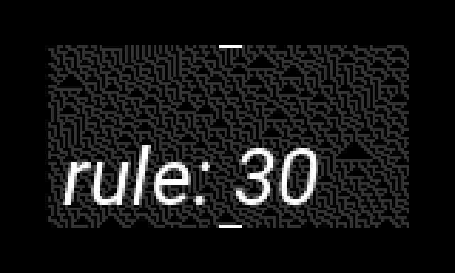

1D cellular automata 
v1.0 imminent gloom 

adapted from elcos 
by zebra 

bright buttons sets state 
other buttons sets rule from context 

every two rows creates a 4-state 
gate stream from crow 

e1 bpm 
e2 rule 
e3 shifts the window 
 
k1 not used 
k2 randomize state 
k3 clear state 
